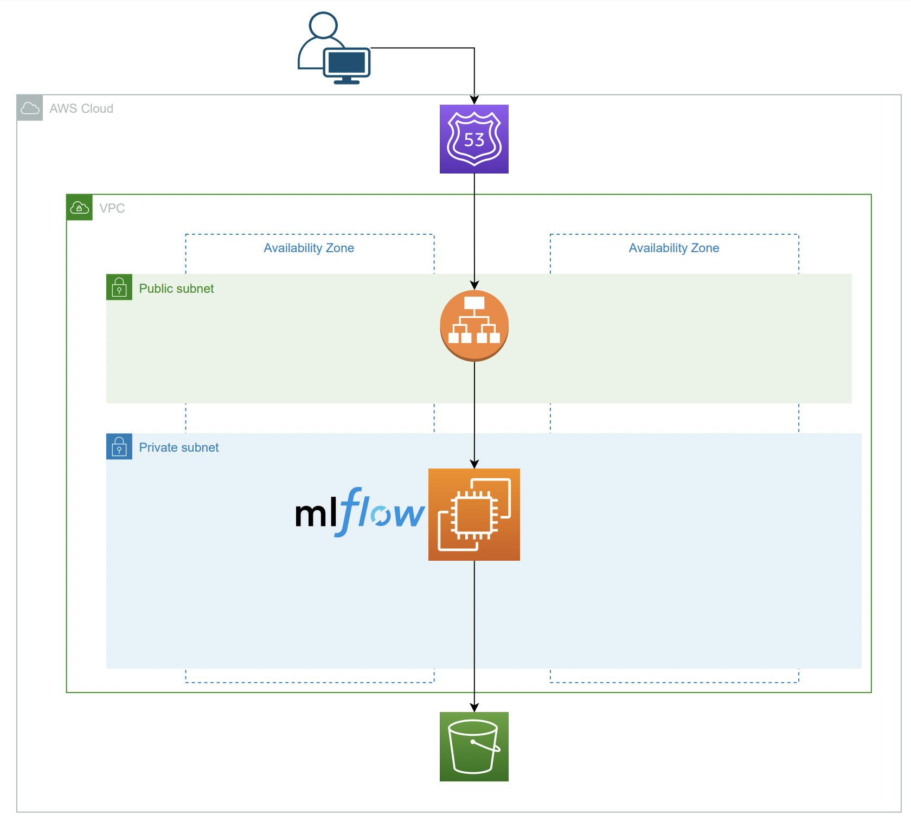

# Demo de AWS Community Day (Implementando  MLFLow en tus experimentos de ML a bajo costo desde EC2)

## Introduccion

Este repositorio tiene la informacion necesaria para seguir el demo de la presentacion de **Usando MLflow con EC2 a bajo costo** en el ambiente del [AWS Community Day Colombia](https://awscommunitydaycolombia.splashthat.com/)

Este repositorio tendra diferentes partes para la instalaciòn y configuraciòn de servicios de AWS de acuerdo a la siguiente arquitectura:

## Enlace relevante

[Guia del Demo con el paso a paso para implementacion](https://docs.google.com/document/d/1Z1-JeTC9gg58TH4lwZOdo67CkA6W0z8fDMJapOrs8Tg/edit?usp=sharing)

## Audiencia
- Equipos de ciencia de datos que quieren dar sus primeros pasos en AWS y mejorar procesos de ML
- Individuos con rol de Cientifico de datos (Data Scientist)
- Individuos con rol de Ingenieros de datos (Data Engineer)
- Individuos con rol de Ingenieros ML (ML Engineer)
- Cualquier otro rol que requiera experiencia práctica para realizar *tracking* de parametros y artefactos relacionados con la administracion de modelos de aprendizaje automático

## Metas
- Introduccion a la arquitectura de AWS a usar para generar el servidor de *Tracking* de MLflow
- Introduccion a MLfLow
- Interaccion con MLflow desde una instancia en red privada que uso balanceador

## Resumen

En este Workdshop/Demo, se discutira: *Usando MLflow con EC2 a bajo costo*.

| **Metas**              | *Ver seccion de Metas arriba*                                    |
| ----------------------------- | --------------------------------------------------------------------- |
| **Que aprenderas**       | *Uso de servicios de AWS: EC2, S3 para implementar el software de Open Source de MLFlow*                                   |
| **Que necesitaras**          | *Cuenta de AWS con free tier* |
| **Duration**                  | *1h*                                                                |
| **Temas**                  | *EC2, uso de systemctl en EC2, S3, MLFLow*                                                                |                       |
| **Slides** | [Powerpoint](slides.pptx)

## Prerequisitos relevantes

- Se debe tener cuenta de AWS
- Se recomienda que a partir de la cuenta root, se debe generar un rol que usaremos para disponibilizar los servicios de AWS de la demo como:
   - VPCs
   - Grupo de seguridad (Security Group)
   - Instancia de EC2
   - Buckets de S3
   - Grupo destinatario (Target group)
   - Balanceador de Carga (Load balancer)

> Nota: En lenguaje de la consola sobre la cual se hicieron las partes del demo esta en Ingles por 2 razones: i) en el futuro sera màs facil generalizar el material para otros usos y ii) se practica ingles.  

## Estructura de la Guia del Demo 
- [Lista de Chequeo de Pre-Workshop](docs/extra_md/part_tips.md)
- [Introduccion](https://docs.google.com/document/d/1Z1-JeTC9gg58TH4lwZOdo67CkA6W0z8fDMJapOrs8Tg/edit?usp=sharing)
- [Parte 1: Adecuaciòn de  VPC](https://docs.google.com/document/d/1Z1-JeTC9gg58TH4lwZOdo67CkA6W0z8fDMJapOrs8Tg/edit?usp=sharing)
- [Parte 2.0: Configuraciòn rol, instancia EC2 y bucket  en S3](https://docs.google.com/document/d/1Z1-JeTC9gg58TH4lwZOdo67CkA6W0z8fDMJapOrs8Tg/edit?usp=sharing)
- [Parte 2.1: Creaciòn y configuraciòn de instancia de EC2 para MLFlow](https://docs.google.com/document/d/1Z1-JeTC9gg58TH4lwZOdo67CkA6W0z8fDMJapOrs8Tg/edit?usp=sharing)
- [Parte 2.2: Configuraciòn de IP elastica para la instancia de EC2 en red publica. Luego, se puede generar AMI para pasar a red privada](https://docs.google.com/document/d/1Z1-JeTC9gg58TH4lwZOdo67CkA6W0z8fDMJapOrs8Tg/edit?usp=sharing)
- [Parte 3: Configuraciòn del balanceador de carga para establecer dominio del servidor MLflow](https://docs.google.com/document/d/1Z1-JeTC9gg58TH4lwZOdo67CkA6W0z8fDMJapOrs8Tg/edit?usp=sharing)
- [Parte 4: Introducciòn a MLFlow y uso desde Jupyter Notebooks](https://docs.google.com/document/d/1Z1-JeTC9gg58TH4lwZOdo67CkA6W0z8fDMJapOrs8Tg/edit?usp=sharing)
- [Tips](https://docs.google.com/document/d/1Z1-JeTC9gg58TH4lwZOdo67CkA6W0z8fDMJapOrs8Tg/edit?usp=sharing)

## Estructura del repositorio
> Nota: Esta es la estructura del repositorio desde la raiz
- `README.md` > README de
- `aws_configuration` > Carpeta donde se encuentran las politicas de permisos de ec2 en formato json
- `notebooks_demo` > Jupyter Notebooks en donde se encuentran los casos de uso del servidor de MLflow deslegado en AWS
- `data` > Se encuentran archivos para usar en los casos de uso dentro de notebooks_demo
- `docs` > Se encuentra informacion auxiliar del repositorio

## Escenario de Demo
> **Nota: Leer lo siguiente antes de empezar!**

Un equipo de analitica quiere empezar a implementar una cultura de MLOps para ir generando una biblioteca de todos los experimentos que han ido generando en su equipo de analitica. Por esto, con su lider tecnico van a implementar un servidor de tracking de [MLflow](https://mlflow.org/docs/latest/what-is-mlflow.html) en infraestructura de AWS dado que las directivas de su organizacion decidieron usar esta nube. 

Igualmente, el lider tecnico del equipo de analitica quiere facilitar la compilacion de la biblioteca de experimentos que miembros del equipo han ido generando en cuadernos de Jupyter en sus cómputo personal. 

## Video (FALTA)

Embed your Train the Trainer video here. Instructions on how to create a great video experience is [available on this page](../video-guidance.md).

- [Introduccion](link)
- [Parte 1: Adecuaciòn de  VPC](link)
- [Parte 2.0: Configuraciòn rol, instancia EC2 y bucket  en S3](link)
- [Parte 2.1: Creaciòn y configuraciòn de instancia de EC2 para MLFlow](link)
- [Parte 2.2: Configuraciòn de IP elastica para la instancia de EC2 en red publica. Luego, se puede generar AMI para pasar a red privada](link)
- [Parte 3: Configuraciòn del balanceador de carga para establecer dominio del servidor MLflow](link)
- [Parte 4: Introducciòn a MLFlow y uso desde Jupyter Notebooks](link)
- [Tips](link)

## Pre-Learning

- [Introduccion a Git (En Ingles)](https://www.youtube.com/watch?v=uR6G2v_WsRA&ab_channel=DavidMahler)

## Contributing (FALTA)
This project welcomes contributions and suggestions.  Most contributions require you to agree to a
Contributor License Agreement (CLA) declaring that you have the right to, and actually do, grant us
the rights to use your contribution. For details, visit https://cla.opensource.microsoft.com.

When you submit a pull request, a CLA bot will automatically determine whether you need to provide
a CLA and decorate the PR appropriately (e.g., status check, comment). Simply follow the instructions
provided by the bot. You will only need to do this once across all repos using our CLA.

This project has adopted the [Microsoft Open Source Code of Conduct](https://opensource.microsoft.com/codeofconduct/).
For more information see the [Code of Conduct FAQ](https://opensource.microsoft.com/codeofconduct/faq/) or
contact [opencode@microsoft.com](mailto:opencode@microsoft.com) with any additional questions or comments.

