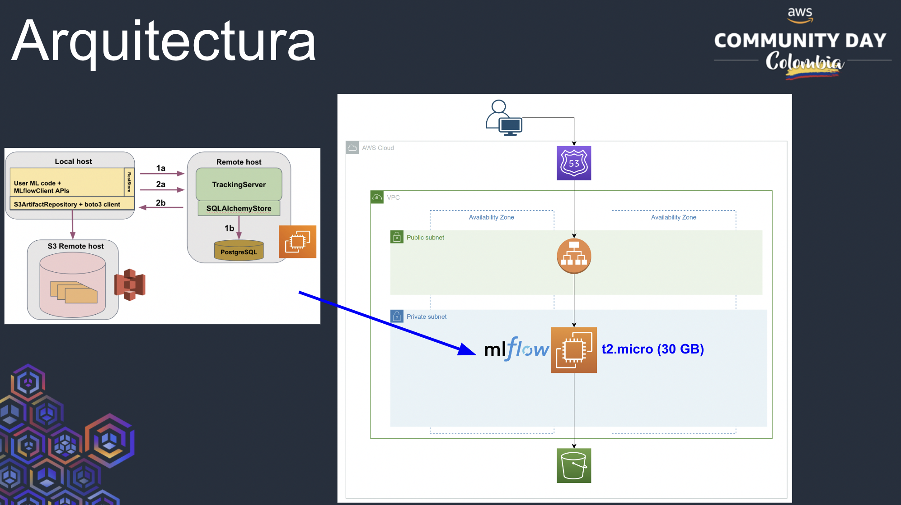

# AWS Community Day Demo (Implementing MLflow in your ML experiments at low cost from EC2)

- 💼 [LinkedIn](https://www.linkedin.com/in/kamymartinez/)
- 🐦 [Twitter](https://twitter.com/kamynz16)

- Demo in [Spanish](https://github.com/KamyNz/awscomunityday2023/tree/demo_spanish)

## Introduction

This repository contains the necessary information to follow the demo from the presentation **Using MLflow at low cost in EC2** in the context of the [AWS Community Day Colombia](https://awscommunitydaycolombia.splashthat.com/) event.

The repository is structured into various sections for the installation and configuration of AWS services, following the architecture outlined below:

## Key Links

[Demo Guide in English - Still working on it but you can use the one in Spanish]

[Demo Guide in Spanish](https://docs.google.com/document/d/1Z1-JeTC9gg58TH4lwZOdo67CkA6W0z8fDMJapOrs8Tg/edit#heading=h.2fqyc447l1ig)

## Key Audience
- Data science teams looking to take their first steps on AWS and enhance ML processes
- Individuals with a Data Scientist role
- Individuals with a Data Engineer role
- Individuals with an ML Engineer role
- Any other role seeking practical experience for tracking parameters and artifacts related to managing machine learning models.

## Goals
- Introduction to the AWS architecture used to generate the MLflow Tracking server
- Introduction to MLflow
- Interaction with MLflow from an instance in a private network that uses a balancer

## Demo Scenario
> **Note: Read the following before you begin!**

An analytics team wants to start implementing an MLOps culture. Therefore, along with their technical leader, they are going to set up a tracking server using [MLflow](https://mlflow.org/docs/latest/what-is-mlflow.html) on [AWS](https://docs.aws.amazon.com/wellarchitected/latest/machine-learning-lens/well-architected-machine-learning.html) infrastructure, as per their organization's directives to use this cloud platform.

Similarly, the technical leader of the analytics team aims to streamline the compilation of the library of experiments that team members have been generating in Jupyter notebooks on their personal computers.

## Summary

In this Workshop/Demo, we will discuss: *Using MLflow at low cost on an EC2 instance*.

| **Goals**        | *See Goals section above*   |
| ----------------- | --------------------------- |
| **What You'll Learn**     | *Using AWS services: EC2, S3, to implement the MLFlow open-source software*  |
| **What You'll Need**  | *AWS account with free tier*   |
| **Duration**  | *1 hour*   |
| **Topics**  | *EC2, EC2 systemctl usage, S3, MLFlow*   |
| **Slides in Spanish** | [Powerpoint](https://docs.google.com/presentation/d/11itQsG_qyVTqX-Havhkr8Ar_jN5ptMe3/edit#slide=id.p1) |

## Relevant Prerequisites
- An AWS account is required
- It is recommended to create a role from the root account that will be used to provision the AWS services for the demo, including:
   - VPCs
   - Security Group
   - EC2 Instance
   - S3 Buckets
   - Target Group
   - Load Balancer

## Demo Guide Structure
- [Pre-Workshop Checklist](docs/extra_md/part_tips_english.md)
- [Introduction](https://docs.google.com/document/d/1Z1-JeTC9gg58TH4lwZOdo67CkA6W0z8fDMJapOrs8Tg/edit?usp=sharing)
- [Part 1: VPC Setup](https://docs.google.com/document/d/1Z1-JeTC9gg58TH4lwZOdo67CkA6W0z8fDMJapOrs8Tg/edit?usp=sharing)
- [Part 2.0: Role Configuration, EC2 Instance, and S3 Bucket Setup](https://docs.google.com/document/d/1Z1-JeTC9gg58TH4lwZOdo67CkA6W0z8fDMJapOrs8Tg/edit?usp=sharing)
- [Part 2.1: EC2 Instance Configuration for MLflow](https://docs.google.com/document/d/1Z1-JeTC9gg58TH4lwZOdo67CkA6W0z8fDMJapOrs8Tg/edit?usp=sharing)
- [Part 2.2: Elastic IP Configuration for Public EC2 Instance. Subsequently, Generating AMI for Transition to Private Network](https://docs.google.com/document/d/1Z1-JeTC9gg58TH4lwZOdo67CkA6W0z8fDMJapOrs8Tg/edit?usp=sharing)
- [Part 3: Load Balancer Configuration to Establish MLflow Server Domain](https://docs.google.com/document/d/1Z1-JeTC9gg58TH4lwZOdo67CkA6W0z8fDMJapOrs8Tg/edit?usp=sharing)
- [Part 4: Introduction to MLFlow and Usage from Jupyter Notebooks](https://docs.google.com/document/d/1Z1-JeTC9gg58TH4lwZOdo67CkA6W0z8fDMJapOrs8Tg/edit?usp=sharing)
- [Tips](https://docs.google.com/document/d/1Z1-JeTC9gg58TH4lwZOdo67CkA6W0z8fDMJapOrs8Tg/edit?usp=sharing)

## Repository Structure
> Note: This is the repository structure from the root

- `README.md` > README with instructions for using this repository
- `aws_configuration` > Folder containing EC2 permission policies in JSON format
- `notebooks_demo` > Jupyter Notebooks containing use cases for the MLflow Tracking server deployed on AWS
- `data` > Files for use in the use cases within notebooks_demo
- `docs` > Supplementary information about the repository

## Learnings and Next Steps

- [Terraform Project for the AWS Community Day Conference Demo (With Modules)](https://github.com/KamyNz/demo-projects-2023/tree/main/awscday2023-terraform-mlflow/experiment-modules-mlflow)

## Pre-Learning

- [Introduction to Git](https://www.youtube.com/watch?v=uR6G2v_WsRA&ab_channel=DavidMahler)

## Contributing

Contributions to this repository are welcome! If you'd like to contribute, please follow these guidelines:

1. **Fork the Repository**: Click the "Fork" button at the top right corner of this repository to create your copy.

2. **Make Changes**: Create a new branch on your fork, make changes or additions to the materials, and commit your changes.

3. **Submit a Pull Request**: Once you're satisfied with your changes, submit a pull request. Be sure to provide a clear and concise description of your changes.

4. **Review and Collaborate**: Collaborators will review your pull request, provide feedback, and merge it into the main repository if everything looks good.

Please follow good coding practices, and ensure that your contributions align with the purpose of this repository.

## License

This repository is licensed under the [MIT License](LICENSE). Please review the license before using or contributing to this repository.

## Acknowledgments

- [Jeico Percy](https://www.linkedin.com/in/jeico-percy-ing-redes/): Offering support and expertise in validating AWS best practices for this exercise.
- [Ana Maria Lopez](https://www.linkedin.com/in/amlopez81/): Providing feedback on the material for this talk.
- [Diego Marulanda](https://www.linkedin.com/in/diegomarulandabarrientos/): Attending my presentation and providing feedback.
- [Juanita Herrera](https://www.linkedin.com/in/juanita-herrera-9152b2172/): Attending my presentation and helping achieve the best results.

